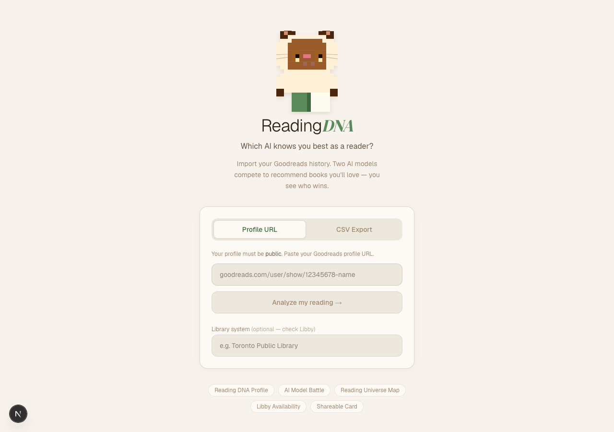
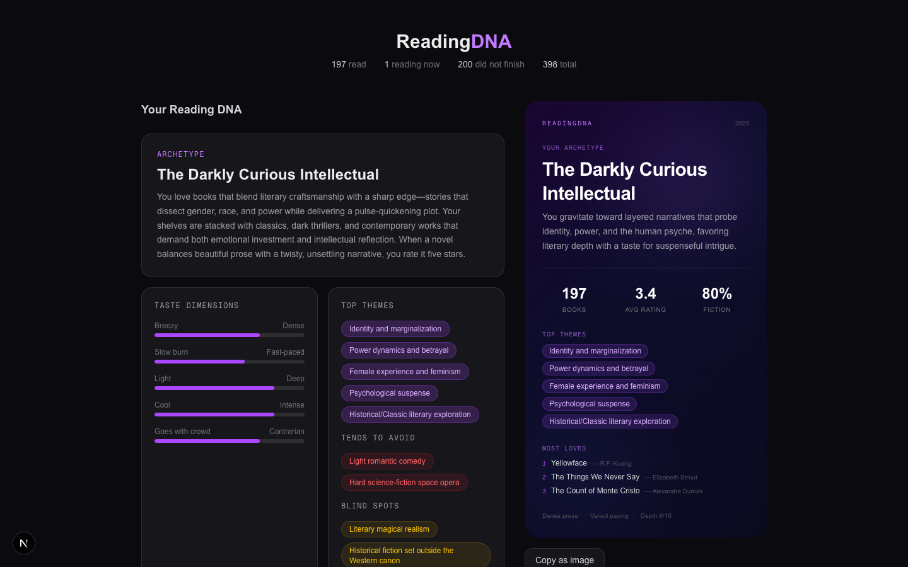
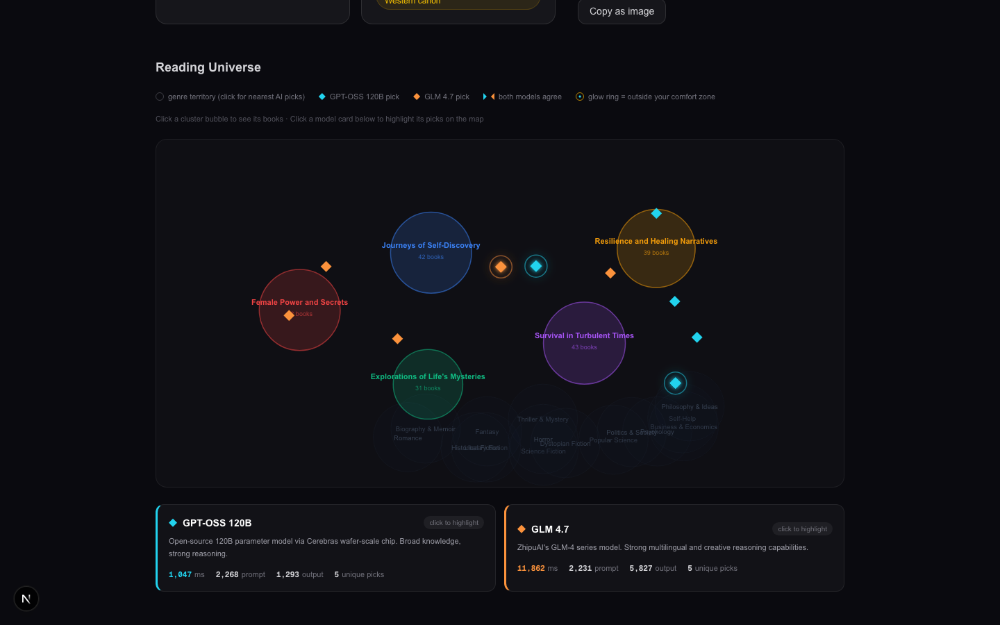

# ReadingDNA

**A live AI model evaluation — applied to your reading taste.**

Paste your Goodreads profile. ReadingDNA builds a semantic taste profile from your reading history, then runs two frontier models head-to-head to recommend your next book. You see exactly which model knows you better, how fast each one responded, and where your recommendations land in the space of all books.

Built to explore a question I work with daily as a TPM on AI evaluation at Microsoft: *given the same context, how differently do two models reason — and how do you measure that?*

---

<p align="center">
  
  
</p>
<p align="center">
  
</p>

*Demo: [Emily May](https://www.goodreads.com/user/show/4622890-emily-may) — Goodreads' most-followed reviewer, 197 books. Archetype: **The Darkly Curious Intellectual**. GPT-OSS 120B responded in **1,047ms**.*

---

## Why Cerebras

A 120-billion-parameter model typically takes several seconds to respond — GPU infrastructure has to move enormous amounts of weight across memory on every token. Cerebras' wafer-scale chip is built differently: the entire model fits on a single chip, eliminating the memory bottleneck.

The result: **GPT-OSS 120B responds in ~1 second.** Same model you'd run on a GPU cluster and wait for — instant on Cerebras.

| Model | Parameters | TTFT | Generation | Total |
|---|---|---|---|---|
| GPT-OSS 120B (Cerebras) | 120B dense | **207 ms** | 1,140 ms | 1,347 ms |
| GLM 4.7 (Cerebras) | 355B MoE (32B active) | **206 ms** | 11,553 ms | 11,759 ms |

Both models start responding in ~200ms — same Cerebras infrastructure, same network. The difference is generation speed: GPT-OSS 120B, a fully dense model, completes in 1.1 seconds. GLM 4.7, despite having only 32B active parameters per token (MoE), takes 11.5 seconds to generate. Cerebras' wafer-scale chip is specifically optimized for dense transformer workloads — that's where the 10× generation speedup comes from.

---

## How it works

1. **Import** — paste your Goodreads profile URL. The backend fetches your read, currently-reading, and did-not-finish shelves via RSS (sequential requests to avoid rate limiting).

2. **Embed + cluster** — each book is converted to a 384-dim embedding via `all-MiniLM-L6-v2` (runs locally, no API cost), then reduced to 2D with UMAP alongside 15 fixed genre anchors. KMeans clusters your books; GPT-OSS 120B names each cluster at `temperature=0` for deterministic labels.

3. **Model battle** — GPT-OSS 120B and GLM 4.7 each independently receive your full reading profile (titles, authors, ratings, themes, archetype) and return 5 recommendations with reasoning. Consensus picks — titles both models chose — are flagged. Recommendations outside your reading clusters get a "comfort zone" marker.

4. **Visualize** — a D3.js map plots your book clusters, genre territory anchors, and AI picks as diamonds (cyan = GPT-OSS, orange = GLM). Click any cluster to expand its books; click any genre anchor to surface the nearest AI picks.

5. **Share** — export a Spotify Wrapped-style card: archetype, avg rating, top themes, most-loved books.

6. **Library check** — OverDrive/Libby availability for every recommendation at your local library system.

---

## Stack

| Layer | Technology |
|---|---|
| Frontend | Next.js 14 (App Router) · TypeScript · Tailwind CSS · D3.js |
| Backend | FastAPI · Python · uvicorn |
| Embeddings | `sentence-transformers` — `all-MiniLM-L6-v2` (local) |
| Dimensionality reduction | UMAP · KMeans (`scikit-learn`) |
| LLMs | Cerebras Cloud SDK — `gpt-oss-120b` · `zai-glm-4.7` |
| Export | `html2canvas` (share card PNG) |

---

## Setup

### 1. Clone and install

```bash
git clone https://github.com/solarrezaei11/reading-dna.git
cd reading-dna
npm install
```

### 2. Python backend

```bash
cd backend
python3 -m venv venv
source venv/bin/activate   # Windows: venv\Scripts\activate
pip install -r requirements.txt
```

### 3. Environment variables

```bash
cp .env.example .env.local
```

Edit `.env.local` and add your [Cerebras API key](https://cloud.cerebras.ai) (free tier available).

### 4. Run

```bash
# Terminal 1 — backend
cd backend && source venv/bin/activate && uvicorn main:app --reload

# Terminal 2 — frontend
npm run dev
```

Open [http://localhost:3000](http://localhost:3000).

### Goodreads profile setup

Your profile must be **public**: Goodreads → Account → Settings → Privacy → "Who can view my profile" → Everyone.

Use your full profile URL: `https://www.goodreads.com/user/show/12345678-your-name`

---

## Design decisions

**Why local embeddings?** Sending 200 book titles to an embedding API on every load adds latency, cost, and a network dependency. `all-MiniLM-L6-v2` runs in ~2s locally and produces embeddings good enough for genre-level clustering.

**Why `temperature=0` for cluster naming?** Early versions used `temperature=0.3`, which caused cluster names to drift between runs for the same library. Deterministic naming means the map is stable — same books always produce the same layout and labels.

**Why sort books before UMAP?** Goodreads RSS returns books in a different order each request. UMAP is sensitive to input order even with `random_state=42`. Alphabetical sort before embedding ensures the layout is reproducible.
