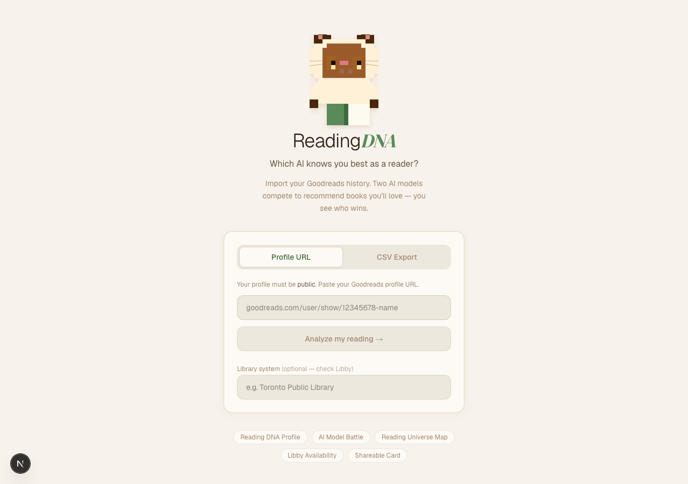

# ReadingDNA

ReadingDNA imports a Goodreads reading history, builds an AI-assisted taste
profile, asks two models for recommendations, and places the results in the
same semantic map as the reader's books.

It is an evaluation-oriented product demo, not a controlled model benchmark.
The app exposes observed latency and an optional local judge, but it does not
measure recommendation quality against reader outcomes or a human-labeled
ground truth.

<p align="center">
  
</p>

## What it does

1. **Imports reading history**
   - Public Goodreads profiles are loaded through paginated RSS shelves.
   - Read, currently-reading, did-not-finish, and want-to-read shelves are
     deduplicated using stable Goodreads identifiers where available.
   - Goodreads CSV exports are supported for rated books.
   - Partial imports remain usable and return visible warnings.

2. **Builds a Reading DNA profile**
   - A deterministic, rating-stratified sample spans both older and newer
     books instead of taking only the first or highest-rated titles.
   - The prompt includes bounded review excerpts and Goodreads average ratings
     when available.
   - Consensus-dependent fields are omitted when the source data is
     insufficient rather than guessed.

3. **Runs a recommendation battle**
   - Cerebras-hosted `gpt-oss-120b` and `zai-glm-4.7` receive the same bounded
     reader evidence.
   - Returned JSON is validated, deduplicated, bounded, and filtered against
     books already read, currently being read, or marked did-not-finish.
   - Want-to-read matches are retained and labeled.
   - Model-supplied ISBNs are verified or enriched through Open Library;
     unverified values are omitted instead of being trusted.
   - A failure from one model does not discard a valid result from the other.

4. **Builds the Reading Universe map**
   - `all-MiniLM-L6-v2` creates local semantic embeddings.
   - KMeans clusters normalized book embeddings.
   - UMAP is fit on the user's books plus fixed genre anchors.
   - Recommendations are transformed into that fitted reference space, so
     adding recommendations does not refit and move the original books.
   - If AI cluster naming fails, the map remains usable with fallback labels
     and a warning.

5. **Checks library availability**
   - Library names, Libby URLs, and OverDrive keys are resolved to the
     library's `preferredKey`.
   - ISBNs are searched in the library catalog, then checked through the
     dedicated title-availability endpoint for current ebook copy and wait
     data.

6. **Optionally runs a local judge**
   - Qwen 2.5 7B runs through Ollama.
   - Each recommendation set is scored independently under an anonymized
     recommender label.
   - The rubric covers relevance, diversity, reasoning depth, novelty, and
     specificity.
   - This is an automated heuristic, not an objective quality label.

## Models and latency metrics

| Model | Notes |
|---|---|
| `gpt-oss-120b` | Mixture-of-experts model, approximately 117B total parameters and 5.1B active parameters |
| `zai-glm-4.7` | Cerebras-hosted GLM recommendation model |
| `qwen2.5:7b` | Optional local judge through Ollama |

For streamed model calls:

- **TTFT** is the measured time from request start to the first non-empty
  content received by the backend.
- **Generation time** is the remaining time from first content to completion.
- **Total time** is the full observed request duration.

These measurements include provider, network, queueing, and client overhead.
They do not reveal why a model was slower and should not be interpreted as a
measurement of hidden reasoning. Results vary by network conditions, provider
load, model revisions, and output length.

The app uses `temperature=0` to reduce sampling variation. That improves
repeatability, but it does not guarantee byte-identical output across provider,
model, SDK, or infrastructure revisions.

## Stack

| Layer | Technology |
|---|---|
| Frontend | Next.js 16, React 19, TypeScript, Tailwind CSS 4, D3.js |
| Backend | FastAPI, Pydantic, HTTPX, Uvicorn |
| Embeddings | Sentence Transformers, `all-MiniLM-L6-v2` |
| Projection and clustering | UMAP, scikit-learn KMeans |
| Hosted LLMs | Cerebras Cloud SDK |
| Optional judge | Ollama with Qwen 2.5 7B |
| Testing | Vitest, React Testing Library, Python `unittest` |

## Requirements

- Node.js 22 is used in CI.
- Python 3.12 or newer.
- A [Cerebras API key](https://cloud.cerebras.ai/) for AI-powered endpoints.
- Optional: [Ollama](https://ollama.com/) with `qwen2.5:7b` for the local judge.

The first embedding request downloads `all-MiniLM-L6-v2` unless it is already
present in the local Hugging Face cache.

## Local setup

### 1. Install the frontend

```powershell
git clone https://github.com/solarrezaei11/reading-dna.git
Set-Location reading-dna
npm ci
```

### 2. Create the backend environment

Windows PowerShell:

```powershell
py -m venv backend\venv
.\backend\venv\Scripts\python.exe -m pip install -r backend\requirements.txt
```

macOS or Linux:

```bash
python3 -m venv backend/venv
backend/venv/bin/python -m pip install -r backend/requirements.txt
```

`backend/requirements.txt` contains the direct runtime dependencies. Use
`backend/requirements.lock.txt` instead when you need the fully pinned
dependency versions used for reproducible validation.

### 3. Configure environment variables

Create a root `.env.local` from `.env.example`:

```powershell
Copy-Item .env.example .env.local
```

```bash
cp .env.example .env.local
```

At minimum, set:

```dotenv
CEREBRAS_API_KEY=your-key
NEXT_PUBLIC_API_URL=http://localhost:8000
NEXT_PUBLIC_SITE_URL=http://localhost:3000
```

`.env.example` documents the remaining limits, CORS, rate, cache, logging,
timeout, and optional backend access-token settings.

### 4. Start both services

Windows PowerShell:

```powershell
.\backend\start.ps1
```

macOS or Linux:

```bash
./backend/start.sh
```

In a second terminal:

```bash
npm run dev
```

Open [http://localhost:3000](http://localhost:3000).

The development launchers load literal key/value entries from the root
`.env.local`, activate `backend/venv`, bind the backend to `127.0.0.1:8000`,
and enable Uvicorn reload.

### Goodreads profile setup

For URL import, the Goodreads profile and relevant shelves must be public.
Use the canonical profile form:

```text
https://www.goodreads.com/user/show/12345678-reader-name
```

For CSV import, use Goodreads **My Books > Import and export > Export
library**.

### Optional local judge

```bash
ollama pull qwen2.5:7b
ollama serve
```

The judge can take substantially longer than the hosted recommendation calls,
especially on CPU-only hardware.

## Configuration and deployment

The backend includes:

- request-body and collection-size limits;
- per-client, per-endpoint in-memory rate limits;
- bounded LLM, CPU, Libby, and lookup concurrency;
- finite external-request timeouts;
- configurable CORS origins;
- optional shared bearer-token protection;
- opt-in prediction logging;
- a non-secret `/health` readiness response.

For a hosted deployment:

1. Serve the frontend and backend over HTTPS.
2. Set `CORS_ORIGINS` to the exact frontend origins.
3. Keep `CEREBRAS_API_KEY` and any backend access token in the hosting
   platform's secret store.
4. Do not put backend secrets in variables prefixed with `NEXT_PUBLIC_`.
5. Do not run Uvicorn with `--reload`; use a process manager or container
   command appropriate for the hosting platform.
6. Put multi-instance deployments behind a shared rate limiter if a global
   limit is required. The built-in limiter and caches are process-local.
7. Leave `RATE_LIMIT_TRUSTED_PROXY_HOPS=0` unless direct backend access is
   restricted to a known proxy chain. When enabled, set it to the fixed
   number of trusted hops that append or replace `X-Forwarded-For`; untrusted
   forwarded prefixes are ignored by selecting from the right side.

The optional bearer token is a deployment-wide control, not user
authentication or multi-tenant authorization. A browser cannot keep a shared
secret. Use it only behind a trusted server-side proxy or an authenticated
ingress that can attach the header.

`NEXT_PUBLIC_SITE_URL` must be set for production metadata, robots, and
sitemap URLs. The safe fallback is `http://localhost:3000`; no live deployment
URL is assumed.

## API surface

| Method | Path | Purpose |
|---|---|---|
| `GET` | `/health` | Non-secret readiness information |
| `POST` | `/parse/csv` | Parse a Goodreads CSV export |
| `POST` | `/parse/rss` | Import paginated public Goodreads shelves |
| `POST` | `/dna` | Generate and validate the Reading DNA profile |
| `POST` | `/battle` | Run and validate both recommendation models |
| `POST` | `/embeddings` | Build the shared map and cluster labels |
| `POST` | `/libby` | Resolve a library and check ISBN availability |
| `POST` | `/judge` | Run the optional local judge |
| `POST` | `/predict` | Predict a rating for a candidate book |

When backend bearer-token protection is enabled, all routes except `/health`
and CORS preflight requests require the configured token.

## Validation commands

Frontend:

```bash
npm run lint
npm run typecheck
npm test
npm run build
npm audit --audit-level=moderate
```

Backend:

```bash
cd backend
python -m pip check
python -m compileall -q .
python -m unittest discover -s tests -p "test_*.py" -v
```

GitHub Actions runs the same frontend checks and installs the pinned backend
lock before compiling and testing Python.

## Privacy

Goodreads imports can include titles, authors, ratings, shelves, and written
reviews. Some AI-powered operations send bounded reading evidence to
Cerebras. Goodreads, Open Library, and OverDrive receive the lookup data
needed for their respective features.

Prediction logging is disabled by default. ReadingDNA does not provide user
accounts or multi-tenant data isolation.

See [PRIVACY.md](PRIVACY.md) before hosting the app or processing another
person's reading history.

## Limitations

- Goodreads RSS and OverDrive are external services. Safety caps, upstream
  errors, or API changes can produce partial results; the UI surfaces warnings.
- CSV import does not provide the same shelf-specific context as RSS import.
- Book titles, authors, editions, and ISBN metadata can be inconsistent across
  Goodreads, model output, Open Library, and OverDrive.
- Libby availability is edition- and library-specific and can change after the
  request completes.
- UMAP is a visualization technique. Nearby points suggest semantic
  similarity, but map distance is not a calibrated relevance score.
- Automated recommendation and judge outputs can be wrong. Reader feedback or
  human evaluation is required to establish real recommendation quality.
